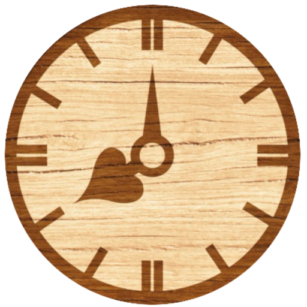
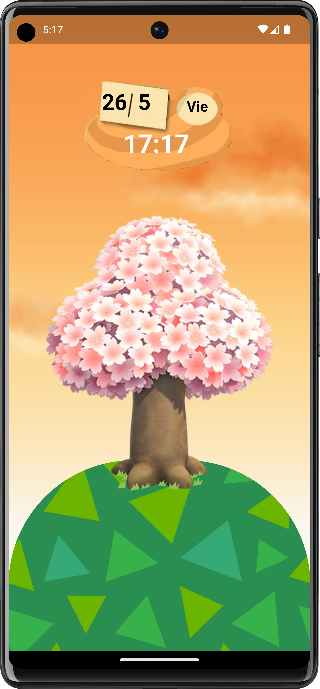
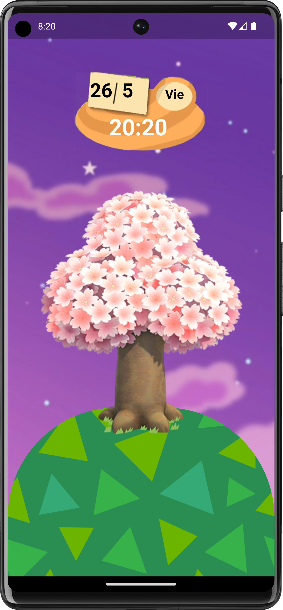
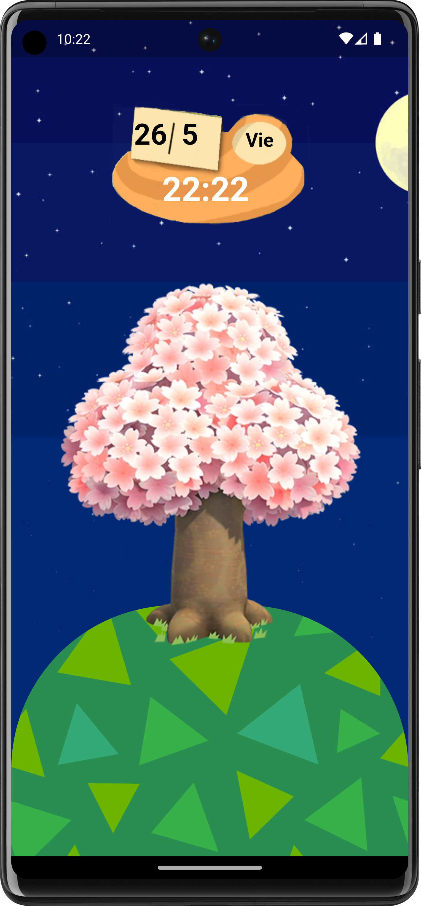
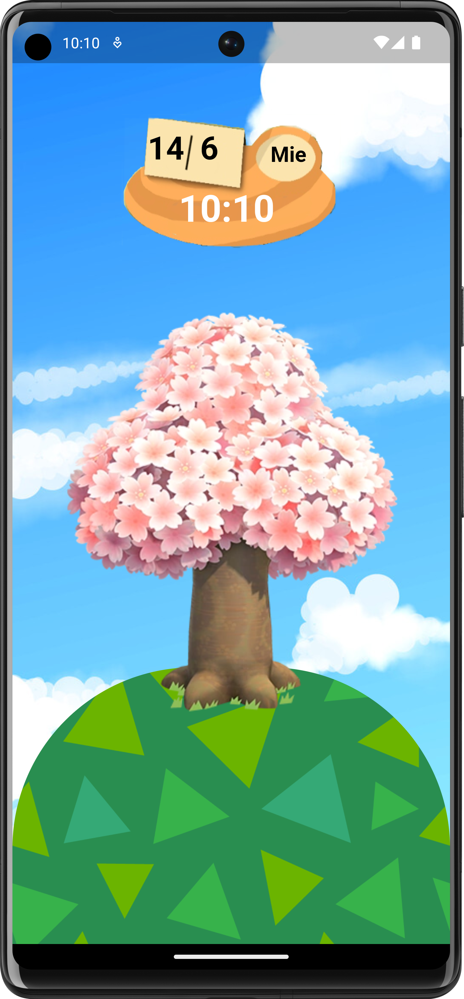
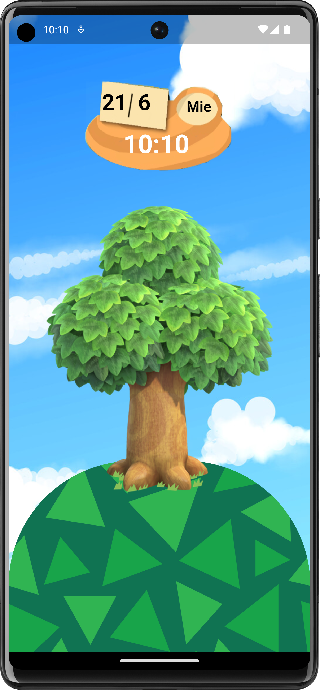
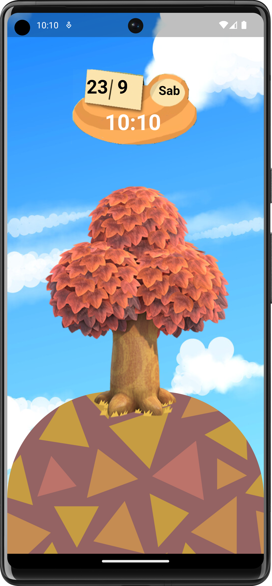
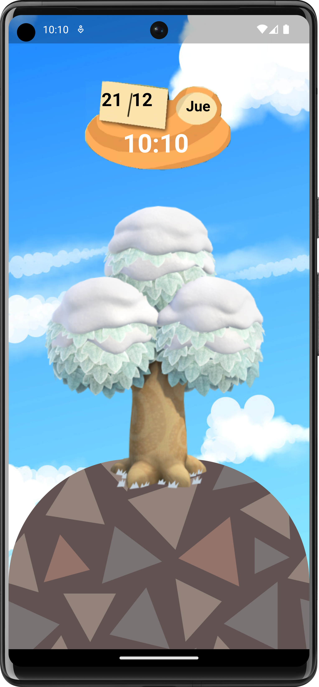

# Animal Crossing Clock
Reloj en tiempo real basado en el mundo de Animal Crossing


# Compatibilidad
- [x] android
- [x] iOS
- [x] web

# Dependencias
Los paquetes que han hecho posible este proyecto

```
  cupertino_icons: ^1.0.2
  audioplayers: ^4.0.1
  quiver: ^3.2.1
  stacked: ^3.2.8
  flutter_launcher_icons: ^0.13.1
  sqflite_common_ffi_web: ^0.3.5+1
  sqflite: ^2.2.8+4
```

# Capturas de Pantalla
Animal Crossing Clock se basa en la fecha de tu dispositivo para
transportarte al mundo de Animal Crossing en ese momento

## Paso del día
Según pasen las horas en tu dispositivo, el color del cielo irá cambiando
así como la melodía

## Mañana


## Atardecer



## Tarde



## Noche


# Paso de las estaciones
Además, Animal Crossing Radio se basa en la estación actual
para ofrecerte fondos basados en esa estación.
En cada estación, verás como cambia el tono de la hierba o las hojas de tu árbol

## Primavera


## Verano


## Otoño


## Invierno

